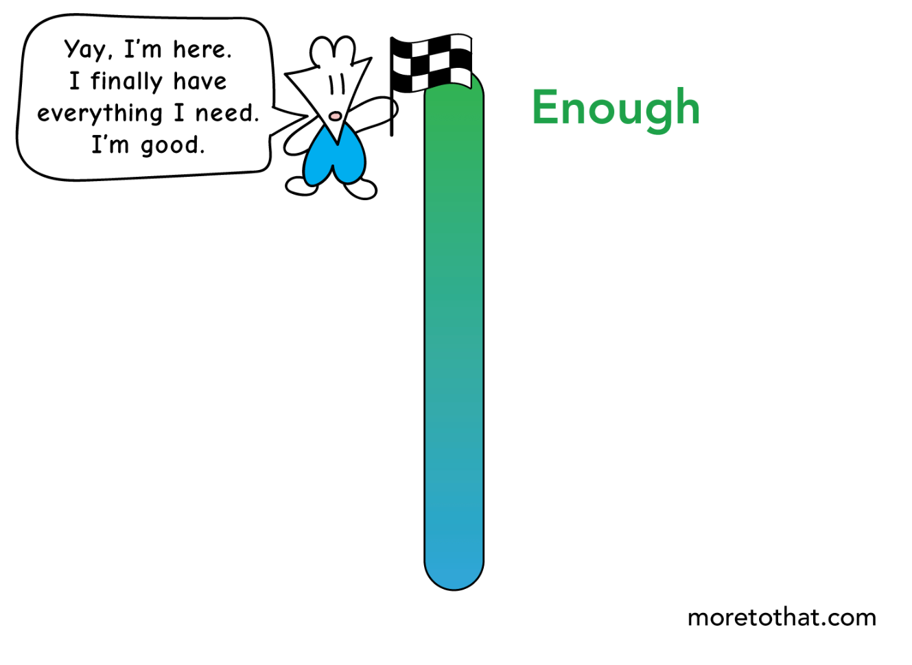
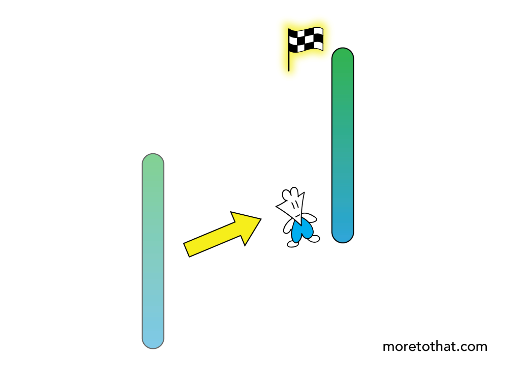
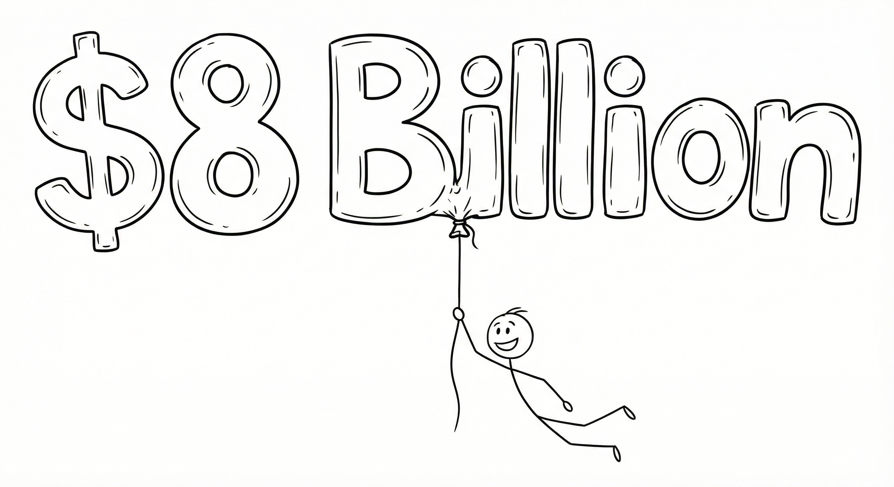
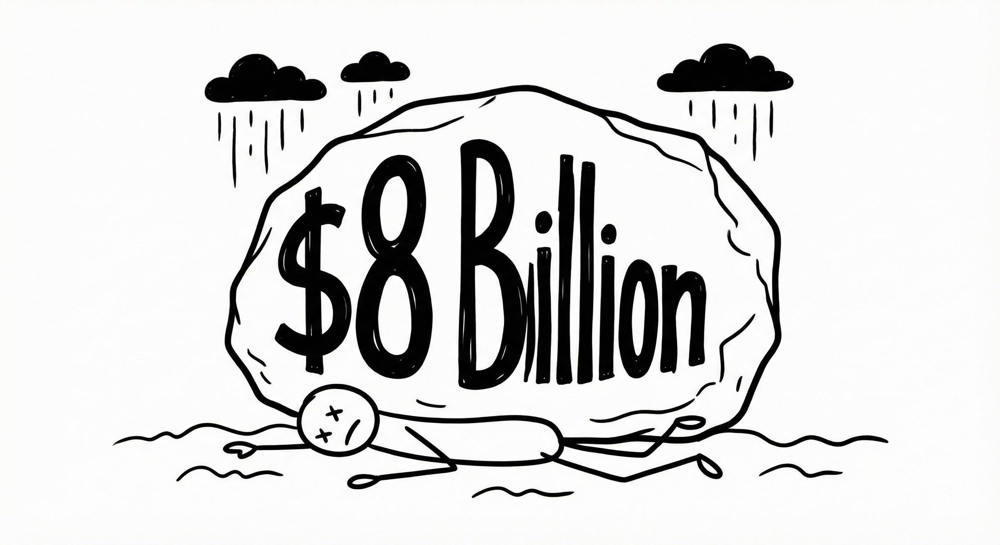
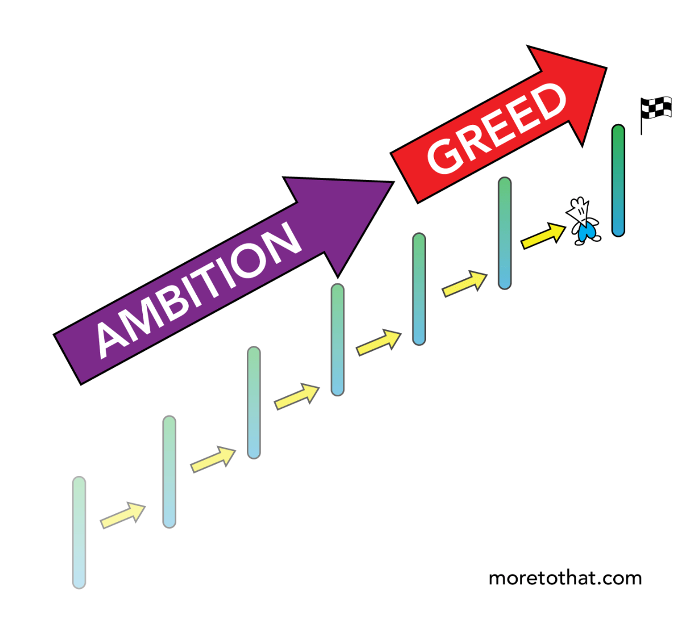
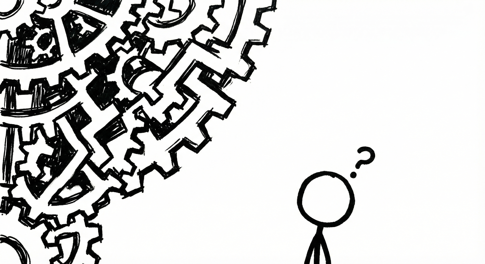

[[toc]]

> 在多重宇宙里寻找足够

---

## Part 1: 在这个制造焦虑的时代

尊敬的俞老师，各位同学，大家下午好。

今天我演讲的主题是 "Find Enough in The Many Worlds"，在中文里可以理解成是"在多重宇宙里寻找足够"。我们今天的旅程就是一段对"足够"的探索。

那么"够"是什么？仔细一想，我们发现，"够"这种感觉在我们的生活中好像非常罕见，他好像只存在于我们的设想中。

与之对应的，我们在生活中在经历的好像都是各式各样的"不够"。不管是你微信/支付宝里的账户余额，亦或是你的游戏段位，又或者说是即将到来的期末考试的分数。我们总感觉是只要我能再多赢几局,再多考几分，我们就能感受到足够了。

但事实真的是这样吗？

最近我读了一篇非常有意思的文章，名字叫《The Many Worlds of Enough》，作者是 Lawrence Yeo，听这个题目也可以发现，他是我这次演讲题目的来源。其实这篇文章他只想回答一个很简单的问题：我们说的这个足够的"够"，这个够多的"够"，究竟应该由谁来定义？这个问题我先把他留在这里，希望最后我们能获得一个答案。

好的，让我们再次回到前面的讨论。

我们总以为等我们获得了我们所说得这个的"Enough"的时候，我们能够真的感受到非常的心满意足，就如同这个画面中的小人一样：I finally have everything I need. I'm good。

但 Lawrance 却说 嘿醒醒，不是这样的。当你不断地向你之前定下的目标前进的时候，你已经并不是最初的你了，你又重新到达了一个起点，要向着更高的目标出发。

在文章里,他写到：The way your progress toward a goal creates an entirely new identity.

可能有点不那么好理解，那我就拿某一款被某些同学评价为世界上最好玩的游戏举例子吧。

当我刚开始玩的时候，我只有0杯，当时的我觉得5000杯就已经是高手了，我的足够就是打上5000杯。可等我打上了5000杯之后，我就会觉得这些5000杯的对手不过尔尔，我应当有更高的追求，我的足够就潜移默化地变成了10000杯，而当我真打上10000杯时，我又会觉得卓翔都要打到名人堂了，这10000杯怎么够呢。

古希腊哲学家赫拉克利特的一句话：**'人不能两次踏进同一条河流。'** 当我们抵达对岸时，河水变了，我们也变了。曾经的我可能觉得我打到多少多少杯就够了。但是我们每次达到那个目标，在那个新的世界，我们会发现一个新的自己。那个新的自己拥有新的技能、新的愿望、新的野心。同时他也有新的对手，新的压力，新的诱惑，所以永远都不够。它就好像是一场无休止的马拉松。每当你快要跑到终点的时候，你就会发现终点线又被挪到了远方。

Lawrence给这件事情 打了一个生动的比方，每当你达成一个目标，你其实就跳进了一个新的平行世界。 在那个新世界里，曾经的那个你以为能得到"满足的你"消失了，取而代之的是一个拥有新欲望、新焦虑的你。

Enough is elusive because when you reach it, you're no longer the person that once desired it.

我想这很好的说明了为什么我们总是会觉得不够

但是这种"不够"的感觉难道不正常吗？我们对于足够的这种渴望难道不是带我们向前的最好的动力吗？下面让我来给大家讲两个故事吧

---

## Part 2: 两个80亿的抉择

### 故事一：查克·菲尼——在1980年按下停止键

在讲第一个故事之前呢，我们先来做一个小游戏，有这样一个人，他上班坐公交车，戴着十五美元的手表，装文件用的是塑料袋，你们觉得他身价多少钱呢？

答案揭晓：80亿美元，你们猜对了吗

而这个人就是我们第一个故事的主人公叫查克·菲尼（Chuck Feeney），The Billionaire Who Wasn't。 大家也许没有听过他的名字，但是你们一定听说过他的公司 DFS ， 虽然不是我们所熟悉的Depth First Search,而是Duty Free Shoppers，全球最大的免税店集团 。而查克菲尼正是他的创始人之一。

早在上世纪60年代，趁着全球旅游热潮，菲尼就赚得盆满钵满。到了70年代，他每年的个人分红就有好几亿美元。 起初，他也像个标准的亿万富翁。他在纽约曼哈顿、伦敦梅菲尔、巴黎，甚至更昂贵的度假胜地都有豪宅。他开豪车，也乘坐私人飞机。按照 Lawrence 的理论，他在不断地跳进更高层级的平行世界。

但是在1982年左右，他突然在百慕大悄悄注册了大西洋慈善基金会，并且坚持绝对匿名。

然后在 1984年。他把自己持有的 DFS 38.75% 的股份全部且转让给了这个 "大西洋慈善基金会"，——当时估值数亿美元，后来增值到几十亿，那从此以后，他就把自己与这个巨额的财富切割开来，仅仅为家人和自己留了未来所需的生活费，大概是200万美元。

这里有两个细节特别震撼： 第一，这是一次不可撤销的转让。也就是说，钱给出去了，就再也不是他的了。 第二，他要求绝对匿名，甚至连跟他做生意的合伙人，都不知道他已经把股份捐了。

直到十二年以后，也就是1996年，当路易斯威登收购了DFS,并且产生了一系列的官司。为了避免在法庭上的纠纷，他主动致电了纽约时报去讲述了自己的故事，1997年一篇He Gave Away $600 Million and No One Knew的文章占据了纽约日报的头条，面对外界的疑问他只是回答了一句话"'I simply decided I had enough money,"

在匿名捐款之后，这位曾经的亿万富翁生活也发生了天翻地覆的变化

​从1980年起，查克菲尼就撤掉了司机和豪车，平时出行的时候改坐公交车或者打出租车，然后长途航班他一律坐经济舱。直到他很晚年的时候，因为他的膝盖伤痛非常的疼，他才偶尔因为这个疼痛升级成商务舱。他也经常被人看到，用超市的那个塑料袋拿着东西去赶飞机。他卖掉了所有的房子，妻子一直住在旧金山的一套租来的两居室里面。他避免去昂贵的餐厅，更喜欢去纽约57街的1家店去吃汉堡。

然后2023年，他在那间租来的公寓里面平静地去世了。

直到他去世，他通过基金会总共捐出了 **80亿美元**。

他的精神Giving while living 影响了后世很多人，比如 比尔盖茨，巴菲特，他们也把自己的大部分资产在生前捐出去，帮助了世界上许许多多的人

### 故事二：阿道夫·默克尔——死在贪婪的跑步机上

第二个故事的主人公叫阿道夫·默克勒（Adolf Merckle）。 他是德国的大实业家，海德堡水泥集团的掌门人，曾经一度是德国第五大富豪。

但他在那个"平行世界"的跳跃游戏中，没能停下来。他拥有了水泥帝国还不够，他想要更多。 2008年金融危机期间，他做了一个巨大的赌注——做空大众汽车股票。做空其实就是和我们平常买股票的思路相反，是去借股票卖钱，然后等过一段时间再把股票买回来，中间如果股票跌了，你就赚钱了。

我可以给大家大致讲解一下当时的情况，其实当时是保时捷公司公司在市场上大肆收购大众股票，导致市场普遍认为大众汽车的估值偏高，而且由于金融危机的到来，大家认为保时捷应该并没有能力继续收购，价格一定会跌。于是大量空头入场，而这其中投资金额最多的就是我们的主人工默克尔。

事情最开始也确实和他们设想的一样，大众公司也受到金融危机的影响导致股价不断下跌。但是历史突然迎来了一个转折点，在2008年的10月，大众公司发生了一场"史诗级别"的逼空，保时捷突然宣布自己已经控制了大众 %74.1 的股份，这个数字有多恐怖呢，首先因为法律问题大众公司有20.1%的股份是被州政府持有不能卖的，再加上保时捷的股份。各大空头发现，现在市面上能流通的股份只剩不到 6% 了，然而这些空头一共借了超过 10%的股份，各大空头都意识到了这点，开始疯抢市面上留存下来的股票，大众的股价在两天内疯涨了5倍，一度成为全球市值最高的公司。

默克勒惨败。他在这次投机中损失了数亿欧元。 更糟糕的是，在这个金融危机期间，为了维持他的庞大的商业版图，他借了很多债。因为这一笔亏损，银行开始催债，导致他的资金链断裂。在短短的几周里，默克勒需要与四十多家银行去谈判，四处去找钱。但在那个最艰难的时候，其实很少人愿意去为他疏困，他始终看不到翻盘的希望。2009年1月，74岁的默克尔留下了一封向家人道歉的遗书，然后在家乡的铁轨前卧轨自杀了。

据福布斯统计，尽管损失了很多钱，默克勒家族当时的资产净值应该还有80亿美元。

---

​听完这两个故事，我不知道大家有什么想法。查克菲尼匿名的把自己的80亿美元的全部身家转进了大西洋基金会，在40年里分批捐完。捐光以后，他住在旧金山的一套租来的两居室里面，出门仍坐经济舱，随身的文件装在超市的塑料袋里，他手上戴的是10美元的卡西欧的手表。

阿道夫默克尔在2008年大众汽车逼空事件中做空失败，损失了数亿欧元，并且陷入了流动性的危机。可是即便如此，在他自杀的时候，他的账面资产仍然有80亿美元左右。

都是80亿美元。我仿佛看到了两句话，第一个就是我已经足够了，第二个是我还要更多。查克菲尼他捐掉了80亿，在我已经足够里看到了自由、轻盈与平静。阿道夫默克尔还拥有80亿，在我还要更多中看到了无尽的缺口和绝望，两个数字都是80亿。同样的数字，有人拿来换自由，有人却因此看到了绝望。

心理学家早就发现说，人对幸福感的评估，往往不是看自己拥有多少，或者说这个绝对值是多少，而是看跟身边的人比起来我是多还是少。

我们每一个目标，那个终点都由曾经的自己去设下。但是却被现在的你所拥有的能力、你的认知、你的欲望、你的朋友圈、你的社交媒体、你的新的评价体系不断的去推向前方，无休无止。

Lance认为在这场终点线不断被推远的比赛中有一件事儿是非常重要的，就是自我审视。就是你需要停下来想你，想对自己来说够应该由谁来定义，是由自己的内心来定义，还是由那个不断前进的自己，有那个自己新的朋友圈、新的社会圈子、新的社会体系，或者说的更直白一些，由那些所激发出来的新的欲望或者说贪念所定义。

查克菲尼在1980年停了下来，重新审视了自己。他的事业依然做得很好，但他对enough的标准，他对足够的标准永远的停在了1980年。阿道夫默克勒一直在推远这场马拉松的终点线，他对enough的标准也不断提高，直到世界给了他致命一击。默克勒难以接受这个别人看起来已经足够的价值80亿美金的enough，他选择了自杀。

Lawrence Yeo 在这里做了一个非常精彩的洞见，

他说，在我们前文所讲的这个目标驱动的光谱上有一条非常细的界限，在这条分界线之前是由ambition驱动的。Ambition可以翻译为雄心、野心、进取心等等。他说ambition的背后是好奇，是热爱，是自我成长，是内在驱动的因素。而在那分界线之后是由greedy驱动的，greedy可以翻译为贪婪，greedy 的背后则是外部评价、攀比心、占有率，排名等等等等。他说如果你静下心来去观察的话，你对任何事情无休止的追求里面都会跨越这个微妙的分界线。而这条分界线或许就是他想说的Enough的具体显现。

查克菲尼找到了这条线，他永远地处于这个Ambition的阶段，用无限的热情和好奇心去拥抱这个世界。默克勒超出了这根线却不自知，拥抱他的就只剩下了无尽的贪婪的深渊。

这条线非常隐蔽。很多时候，我们是怀着 Ambition 出发的，但可能跑着跑着，不知道在哪一刻，我们就跨过了那条线，我们不再享受奔跑本身，变成了贪婪的囚徒。

---

## Part 3: 身边的故事

我有一个朋友，他在大一的暑假里开始接触股市，起初他怀揣着一种对这些金融知识的好奇，一种Ambition ，开始学习各类理财的相关知识，想要通过复利为未来积累点本金。恰逢当时牛市，运气也不错，随便买几手可能就是百分之十几二十的收益。

但很快，这种Ambition变质了。先是天有不测风云，随着牛市过后，伴随着一轮的总体的下沉，他开始不断地亏钱，他看他的朋友晒那种一天赚20%的截图，心生向往，开始去追逐那些波动极大的妖股。他不再关心这家公司好不好，他只关心"他今天要比昨天多赚多少"。他跨过了那条线，滑向了贪婪。

那段时间，他就像个神经质一样。 上课的时候，手机藏在电脑后面刷K线； 吃饭的时候，盯着屏幕上的红红绿绿发呆； 明明账户里其实也就几百几千块钱的波动，但他可能每天要打开那个软件几十次。

终于，在后面又一次被资本狠狠的毒打后，他直接破防了，他开始陷入了深深的自我怀疑和反思，这时他忽然想起了他之前读过的一些相关的文章， 他想起了前面讲的阿道夫默克勒，他想起了那条 ambition 和 greedy 的分界线. 是的，他其实早就知道了这个洞见，但是当你真的去尝试实践的时候，你就会发现这中间的那条间隔是如此的困难。

他想起了著名财经作家摩根·豪塞尔的一句话： "If you are constantly checking something, you are not rich."

他想这个富有并不仅仅代表了财富的富有，更是一种精神，心灵上。虽然他没亏什么钱，但是在这个追逐更多的过程中，他把他最宝贵资源的**注意力**——那些本该用来读书、交友、探索世界的精力——全部廉价地卖给了那个跳动的数字。 他就像默克尔一样，被"更多"绑架了，失去了最初的 ambition , 滑落到了 greedy的深渊。

于是，在艰难的抉择后，他强迫自己删了软件一周。这件事情在他朋友的朋友圈里亦有记载。

刚开始的几天自然是艰苦的，虽然他删除了软件但是那种缺失信息的不安全感还是在的，他还是不自觉地经常的打开手机，然后看着那消失地软件发愣。但是等过了几天，他尝试完全不去想这些相关事情。他开始重新回到之前的节奏，去更专注地学习各类知识。

当他不再时刻盯着它的时候，他发现钱并没有少，而他的生活回来了。

---

## Part 4: 消费主义系统

这个故事的结局还是比较美好的。但是，我开始产生了一些进一步的疑惑，虽然前文讲了产生不够的原因是因为内心的欲望在成长的过程中不断地增加，我不再是原先的我了。但是，为什么我的朋友明明知道这些个道理，却还是控制不住要去刷那个软件？为什么很多时候我们明明知道"够了"，却还是忍不住想要更多？

安东尼加鲁索写过一本书叫做《制造消费者：消费主义全球史》，书中的观点令人有些背脊发凉：因为我发现这并不仅仅是我们个人的意志力问题，这是一场持续了200年的、针对我们潜意识的精密工程。

书中有这样一句话听起来让人很毛骨悚然：工业文明最伟大的产品，并不是琳琅满目的商品，而是那一颗颗"渴望拥有商品"的心。

早在19世纪，随着生产力的爆发，人类第一次面临产能过剩。为了把商品卖出去，系统必须把人训练成"消费者"。于是，百货商店诞生了。最早的百货大楼用镜子、灯光和宏大的楼梯，把购物变成了一种娱乐。 书里写到，当年那个想出"延长百货商场楼梯"的天才设计师非常得意，因为更长的楼梯意味着顾客在店里停留的时间更长，产生购买欲望的概率就更大。

但是，我在想，如果这位百货公司的天才穿越到今天，看到我们的智能手机，他一定会大感震惊，甚至自愧不如。 因为在移动互联网时代，我们不再需要走进商场，我们每个人都自愿变成了一个行走的橱窗。

想一想我们的社交媒体。我们每天精心地经营着自己的朋友圈，晒出我们吃过的精致料理、打卡过的网红景点、刚买的各种潮玩手办。 这就像书里说的，200年前，人们买一张桌子是为了在上面放东西；但今天，我们消费一个商品，是为了让它成为一个符号，一个标签。我们通过拥有什么，来向世界宣示"我是谁"。

这是一个巨大的经济循环。这台巨大的机器被无数的"想要"推着运转。 确实，硬币的一面是，我们享受了前所未有的物质丰富和便利；但硬币的另一面是，我们被催生出了无穷无尽的"想要"。

那么问题来了：在这台疯狂运转的机器里，我们——作为每一个具体的个体，真的变得更幸福了吗？

1974年，美国经济学家理查德·伊斯特林提出了著名的"伊斯特林悖论"（Easterlin Paradox）。 他研究发现，在一个时间点上，有钱人确实比穷人幸福。**但是**，如果我们拉长历史的时间轴，随着国家GDP的持续增长，人们的整体幸福感并没有随之上升，甚至在某些时期是下降的。

为什么？伊斯特林给出了两个解释，恰好完美呼应了我们今天的主题。 第一个原因叫**"享乐适应"**。这也就是 Lawrence Yeo 说的平行世界——你适应了新的环境，你的快乐阈值被提高了，你并没有因为拥有更多而快乐，你只是习惯了。 第二个原因叫**"社会比较"**。这也是为什么社交媒体让我们如此焦虑。因为人的幸福感往往不是由绝对值决定的，而是由相对值决定的。虽然我考了90分，但如果朋友圈里大家都晒出了95分的成绩单，我的90分带来的快乐瞬间就消失了。

**工业社会制造了商品，也制造了比较；制造了繁荣，也制造了焦虑。**

所以，当我们说"Find Enough"的时候，我们不是在对抗自己的贪婪，我们实际上是在对抗一个庞大的、精密的、致力于让我们"永不满足"的系统。

---

## Part 5: 做减法的艺术

既然我们知道了这个系统的运作逻辑，既然我们知道了"比较"和"适应"是偷走幸福的小偷，那我们该如何反击？ 与其在这个不断加速的跑步机上通过追求"更多"来获得短暂的安慰，不如真正地沉下心来，去尝试做减法。

首先，Remove noise。 像查克·菲尼切断与奢华生活的联系一样，试着切断那些引发你焦虑的信息源。 如果你看到朋友圈里别人晒的什么四六级成绩，体育考试分数、晒的精致生活让你感到焦虑，让你觉得自己"不够"，那就关掉它。那是别人的橱窗，不是你的生活。

其次 Redefine Enough 。Lawrence Yeo 说："虽然我们无法完全摆脱'多'的诱惑，但我们可以通过不断的自我审视（Self-Audit），让那条区分野心与贪婪的界线变得清晰。" 在平行世界分裂之前，为自己设定一个锚点。这个锚点应该由你的Ambition,（也就是你想成为什么样的人）来定义，而不是由greedy（也就是别人觉得你应该拥有多少）来定义。

还有第三点，也是我认为最重要的一点，重新夺回我们的注意力，也就是Reclaim Attention。这是我们作为学生最宝贵、也是最容易被挥霍的资产。 AI 领域有一篇奠基性的论文叫《Attention Is All You Need》（注意力就是你所需要的一切）。在人生里也是一样。 **Attention is your only currency.** 不要把它浪费在无止境的比较和"时刻检查"上。

最后，我想用电影《白日梦想家》里我很喜欢的一幕来结束今天的分享。

具体故事情节我就不剧透了，这个片段大概是讲，主角 Walter 历经千辛万苦，终于在喜马拉雅山找到了那个摄影师肖恩。当时，Sean 正在蹲守一只极为罕见的雪豹，摄影师管它叫"ghost cat"。 就在他们等待的时候，雪豹终于出现了！如此的美丽，神圣。 Walter 激动地催促 Sean：（When are you going to take it?）

Sean 并没有拍照。他只是静静地看着那只雪豹，说了一段话： "Sometimes I don't. If I like a moment... I don't like to have the distraction of the camera. I just want to stay in it."

正如他前面所讲的： **"Beautiful things don't ask for attention."**

那些在手机屏幕上疯狂跳动的股价，那些在社交媒体上大声喧哗的炫耀，它们都在疯狂地 Ask for attention，所以它们往往不够美好，也不够真实。

而真正的财富——无论是查克·菲尼内心的宁静，那些晦涩难懂的知识，还是你们此刻拥有的青春、好奇心和专注力，它们就像那只雪豹，安静地待在那里。

愿我们都能学会做减法，在喧嚣的世界里，找到属于自己的那只雪豹，然后，仅仅是"待在那个瞬间里"，触碰真正的自由。

谢谢大家。
